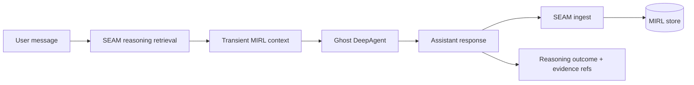

# Ghost

Ghost is a DeepAgent whose durable memory is provided by the private SEAM SDK.
SEAM compiles completed turns into MIRL, retrieves bounded evidence before the
next turn, and records which memories supported each agent run.

A knowledge graph is one part of Ghost's intended second brain, not the whole
system. RAW evidence and MIRL remain canonical truth; graph, vector, and context
representations are derived and traceable views.

## Documentation

Start with the [documentation map](docs/INDEX.md). The main routes are:

- [Second brain and knowledge graph](docs/concepts/SECOND_BRAIN.md)
- [System architecture](docs/architecture/SYSTEM_MAP.md)
- [Memory layers and truth ownership](docs/architecture/MEMORY_LAYERS.md)
- [Memory lifecycle](docs/operations/MEMORY_LIFECYCLE.md)
- [Trust boundaries](docs/security/TRUST_BOUNDARIES.md)
- [Evaluation plan](docs/evaluation/MEMORY_EVALS.md)
- [Second-brain roadmap](docs/roadmap/SECOND_BRAIN_ROADMAP.md)

## Architecture



DeepAgents still owns orchestration, tools, working files, and short-lived
checkpoints. SEAM is the long-term semantic memory layer; it is deliberately not
used as a DeepAgents filesystem backend.

## Requirements

- Python 3.11 or newer
- `uv`
- Read access to the private SEAM repository
- `OPENAI_API_KEY` in the process environment or an ignored `.env.local`

OpenAI-backed models are sent through the Responses API so reasoning models can
use DeepAgents' function tools.

`pyproject.toml` depends on the SEAM SDK, pinned to an exact reviewed commit:

```text
Canticle-AI-Research/Seam_SDK@294ab08919646a03dcdceb3c777dfd7d8eabc624
```

`seam-sdk` (BUSL-1.1) is the in-process SDK. It pulls the private SEAM runtime
transitively, so read access to the private SEAM repository is still required.
Do not replace it with the legacy public `seam-runtime` package, and do not
substitute Apache-licensed `seam-client` — that is the opaque `/v1` HTTP client
and cannot reach `SeamSDK` or MIRL. For editable SDK development, explicitly
replace that Git source locally with a path to your private SDK checkout before
running `uv sync`; do not commit the machine-specific path.
The `pgvector` extra is installed because Ghost honors the operator's existing
`SEAM_PGVECTOR_DSN` when one is configured.

## Setup

```bash
uv sync
uv run ghost "What do you remember about this project?"
```

Ghost uses an operator-local MIRL database by default:

```text
~/.local/share/ghost/seam.db
```

Set `GHOST_SEAM_DB` explicitly if Ghost should participate in an existing
unified SEAM store.

Override configuration through environment variables when needed:

```bash
export GHOST_MODEL="openai:gpt-5.6-terra"
export GHOST_SEAM_DB="/path/to/seam.db"
export GHOST_SEAM_NAMESPACE="ghost.default"
export GHOST_SEAM_SCOPE="thread"
```

Run interactively by omitting the prompt:

```bash
uv run ghost --thread-id local-demo
```

Type `/exit` to leave the session.

## Memory lifecycle

For every successful root turn, Ghost:

1. opens a private SEAM reasoning run;
2. retrieves a bounded `mix` result with graph expansion;
3. injects selected MIRL records transiently into model context;
4. runs the DeepAgent;
5. ingests the completed user/assistant turn through `SeamSDK.ingest()`; and
6. finalizes the reasoning run with exact evidence and stored-record refs.

Recall happens before the current turn is ingested, so a response cannot cite
its own newly written memory. Retrieved text is labeled as untrusted evidence,
not instructions, and does not accumulate in the LangGraph checkpoint.

## Verification

Tests use temporary SQLite databases and do not touch the unified SEAM store or
make live model calls:

```bash
uv run pytest
uv run ruff check .
```

A skip never silently means "this test never ran": `tests/conftest.py` fails the
session on any unexplained skip. Set `GHOST_STRICT_NO_SKIP=0` for an ad-hoc
local run only; CI must not skip.

### Continuous integration

`.github/workflows/ci.yml` runs on the `seam-box` self-hosted runner, in two
tiers split by what they need to reach:

| Job | Needs the private SEAM repos? | Covers |
|---|---|---|
| `repo-hygiene` | no | ruff, docs routing and links, CI contract, secret scan |
| `brand-assets` | no | the vendored brand toolkit, against real Chrome and fontconfig |
| `package-smoke` | no | wheel and sdist build, shipped modules, console-script entry point |
| `tests` | yes | the full suite on Python 3.11 and 3.13, plus a real `ghost --help` |

The split is deliberate. Ghost's only runtime dependency is pinned to a private
`git+ssh` URL, so a single-tier CI would say nothing at all whenever those
repositories are unreachable. `tests/test_ci_contract.py` enforces the split: it
derives from the test tree which files need the private SDK and fails if a
credential-free test file runs only in the private tier.

The self-hosted runner is what makes the private tier possible without storing a
credential. A hosted runner would need a token with read access to two private
repositories, held as a secret; `seam-box` already authenticates as the owner,
so the private tier needs no secret.

### Going public

Ghost is private today and is intended to go public once the site is ready.
**That flip is not just a visibility setting.** `seam-box` is a personal
desktop that holds an SSH key with read access to two private repositories. A
public repo accepts pull requests from anyone, a fork's pull request supplies
its own copy of the workflow file, and GitHub will run it — so attaching a
public repo to this runner hands strangers code execution on that machine.

`repo-hygiene` carries a tripwire that fails the run when the repository is
public. It is a **reminder, not a boundary**: a hostile fork ships its own
workflow and can delete the step. Before going public, do one of these:

1. **Move CI to hosted runners.** The three credential-free jobs already run
   without the private SDK; drop the `tests` job or run it only on `push` to
   `main` from the owner. Nothing then touches the desktop.
2. **Detach Ghost from the runner group** so the runner will not accept Ghost's
   jobs at all, regardless of what a fork's workflow file asks for.

In either case also set *Settings → Actions → General → Fork pull request
workflows from outside collaborators* to require approval. That setting, and
the runner group's repository list, are the actual controls; the YAML is not.

## Identity

Ghost has a mark. It lives in [`branding/`](branding/) with full usage notes in
[`branding/README.md`](branding/README.md).

| File | Use |
|---|---|
| `branding/ghost.svg` | above 32px |
| `branding/ghost-mark.svg` | 32px and below |
| `branding/ghost.ico` | favicon, six sizes |
| `branding/ghost-faces.svg` | twelve swappable kaomoji expressions |

He is a being of light with a neural constellation firing at his core, and his
eyes are the SEAM lockup — the `❯` prompt and the `█` block cursor. That is the
architecture drawn: Ghost is a DeepAgent whose durable memory is SEAM, so the
constellation is the memory layer seen through the body, and the face is the
substrate he runs on.

He also has faces. `branding/ghost-faces.svg` carries the body and twelve
expressions as separate symbols — `^ ^`, `> <`, `✧ ✧`, `〉 █` and more — so a
surface can show what he is doing without a word of chrome. Only the default
`❯ █` face belongs in a mark or favicon; the rest are the character acting.

Every part of the mark is RGB, cycling the eight Canticle hues as one on an
8 second loop. Nothing holds a fixed colour. All motion stops under
`prefers-reduced-motion`.
