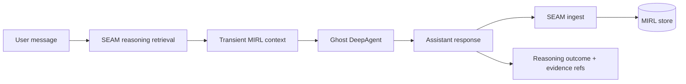

# Ghost

Ghost is a DeepAgent whose durable memory is provided by the private SEAM SDK.
SEAM compiles completed turns into MIRL, retrieves bounded evidence before the
next turn, and records which memories supported each agent run.

A knowledge graph is one part of Ghost's intended second brain, not the whole
system. RAW evidence and MIRL remain canonical truth; graph, vector, and context
representations are derived and traceable views.

## Documentation

Start with the [documentation map](docs/INDEX.md). The main routes are:

- [Second brain and knowledge graph](docs/concepts/SECOND_BRAIN.md)
- [System architecture](docs/architecture/SYSTEM_MAP.md)
- [Memory layers and truth ownership](docs/architecture/MEMORY_LAYERS.md)
- [Memory lifecycle](docs/operations/MEMORY_LIFECYCLE.md)
- [Trust boundaries](docs/security/TRUST_BOUNDARIES.md)
- [Evaluation plan](docs/evaluation/MEMORY_EVALS.md)
- [Second-brain roadmap](docs/roadmap/SECOND_BRAIN_ROADMAP.md)

## Architecture



DeepAgents still owns orchestration, tools, working files, and short-lived
checkpoints. SEAM is the long-term semantic memory layer; it is deliberately not
used as a DeepAgents filesystem backend.

## Requirements

- Python 3.11 or newer
- `uv`
- Read access to the private SEAM repository
- `OPENAI_API_KEY` in the process environment or an ignored `.env.local`

OpenAI-backed models are sent through the Responses API so reasoning models can
use DeepAgents' function tools.

`pyproject.toml` depends on the SEAM SDK, pinned to an exact reviewed commit:

```text
Canticle-AI-Research/Seam_SDK@294ab08919646a03dcdceb3c777dfd7d8eabc624
```

`seam-sdk` (BUSL-1.1) is the in-process SDK. It pulls the private SEAM runtime
transitively, so read access to the private SEAM repository is still required.
Do not replace it with the legacy public `seam-runtime` package, and do not
substitute Apache-licensed `seam-client` — that is the opaque `/v1` HTTP client
and cannot reach `SeamSDK` or MIRL. For editable SDK development, explicitly
replace that Git source locally with a path to your private SDK checkout before
running `uv sync`; do not commit the machine-specific path.
The `pgvector` extra is installed because Ghost honors the operator's existing
`SEAM_PGVECTOR_DSN` when one is configured.

## Setup

```bash
uv sync
uv run ghost "What do you remember about this project?"
```

Ghost uses an operator-local MIRL database by default:

```text
~/.local/share/ghost/seam.db
```

Set `GHOST_SEAM_DB` explicitly if Ghost should participate in an existing
unified SEAM store.

Conversation checkpoints are persistent and live in a **separate** database
(`GHOST_CHECKPOINT_DB`, defaulting beside the SEAM store), so `--thread-id`
resumes a conversation after the process exits. The checkpoint holds execution
state — where the conversation got to — and never semantic truth; SEAM remains
the only thing that remembers what was said. Keeping them in different files
makes that boundary physical rather than a convention.

Override configuration through environment variables when needed:

```bash
export GHOST_MODEL="openai:gpt-5.6-terra"
export GHOST_SEAM_DB="/path/to/seam.db"
export GHOST_SEAM_NAMESPACE="ghost.default"
export GHOST_SEAM_SCOPE="thread"
```

Run interactively by omitting the prompt:

```bash
uv run ghost --thread-id local-demo
```

Type `/exit` to leave the session.

## Tools

Ghost's tools are read-only, built to the contract in
[`docs/security/TRUST_BOUNDARIES.md`](docs/security/TRUST_BOUNDARIES.md).

| Tool | Does | Available |
|---|---|---|
| `seam_recall` | reads Ghost's durable SEAM memory | always |
| `read_file` | reads one UTF-8 file inside a configured root | when `GHOST_TOOL_ROOTS` is set |
| `search_repo` | searches configured roots for a literal string | when `GHOST_TOOL_ROOTS` is set |
| `run_command` | **runs a shell command — changes the machine** | when `GHOST_ENABLE_SHELL=1` |

`seam_recall` is a deliberate mid-turn lookup, distinct from the automatic
pre-turn recall the middleware performs. It reaches SEAM only through
`SeamMemory.query_knowledge`, so the SDK's `ingest`, `apply_delete`,
`apply_promotion`, and `lifecycle_operation` are unreachable from a tool — a
tool that can delete memory is a tool a prompt injection can delete memory
with.

The filesystem tools are absent unless the operator names readable roots:

```bash
export GHOST_TOOL_ROOTS="/path/to/repo:/path/to/notes"
```

Every path is resolved before the containment check, so a symlink inside a root
that points outside it is refused rather than followed.

### Shell access

`run_command` gives Ghost your account's full authority on the machine. It is
off unless you turn it on:

```bash
export GHOST_ENABLE_SHELL=1
export GHOST_SHELL_WORKDIR="/path/to/work"   # defaults to the current directory
```

There is deliberately **no denylist of dangerous commands**. Pattern-matching
shell strings is trivially bypassable and would imply a protection that does
not exist. The real controls are:

- **opt-in** — without `GHOST_ENABLE_SHELL` the tool is not built at all;
- **approval** — `GHOST_SHELL_APPROVAL` defaults on whenever the shell is on,
  and the CLI prompts on the terminal before each command. With no terminal to
  ask, the answer is no. Set it to `0` only for deliberate unattended runs;
- **timeouts** — every command is capped, and the model may narrow that cap but
  never widen it; and
- **verification** — each command becomes a `decision` node with a `tool` check
  carrying its real exit code, and SEAM refuses to accept the turn's outcome
  against a check that failed.

A refused command is returned to Ghost as a tool result, not an exception, so
declining one command does not end the conversation.

Command output is passed to SEAM as a check result, which SEAM reduces to a
length and a SHA-256. The output itself is never stored, which is what makes
shell output admissible at all — it routinely carries environment and tokens
that [trust boundaries](docs/security/TRUST_BOUNDARIES.md) forbid becoming
durable memory.

## Memory lifecycle

For every successful root turn, Ghost:

1. opens a private SEAM reasoning run;
2. retrieves a bounded `mix` result with graph expansion;
3. injects selected MIRL records transiently into model context;
4. runs the DeepAgent;
5. ingests the completed user/assistant turn through `SeamSDK.ingest()`; and
6. finalizes the reasoning run with exact evidence and stored-record refs.

Recall happens before the current turn is ingested, so a response cannot cite
its own newly written memory. Retrieved text is labeled as untrusted evidence,
not instructions, and does not accumulate in the LangGraph checkpoint.

## Verification

Tests use temporary SQLite databases and do not touch the unified SEAM store or
make live model calls:

```bash
uv run pytest
uv run ruff check .
```

A skip never silently means "this test never ran": `tests/conftest.py` fails the
session on any unexplained skip. Set `GHOST_STRICT_NO_SKIP=0` for an ad-hoc
local run only; CI must not skip.

### Continuous integration

Ghost separates public-safe verification from private integration:

- `.github/workflows/public-ci.yml` runs automatically on pull requests and
  `main` pushes using GitHub-hosted runners. It never installs Ghost, resolves
  private dependencies, reads repository secrets, or targets self-hosted
  infrastructure.
- `.github/workflows/ci.yml` is manual-only. It targets `seam-box` for the
  private SEAM dependency, and paid live tests additionally require the
  operator to select `run_live` explicitly.

The private workflow remains split by what each job needs to reach:

| Job | Needs the private SEAM repos? | Covers |
|---|---|---|
| `repo-hygiene` | no | ruff, docs routing and links, CI contract, secret scan |
| `brand-assets` | no | the vendored brand toolkit, against real Chrome and fontconfig |
| `package-smoke` | no | wheel and sdist build, shipped modules, console-script entry point |
| `tests` | yes | the full suite on Python 3.11 and 3.13, plus a real `ghost --help` |

The split is deliberate. Ghost's only runtime dependency is pinned to a private
`git+ssh` URL, so a single-tier CI would say nothing at all whenever those
repositories are unreachable. `tests/test_ci_contract.py` enforces the split: it
derives from the test tree which files need the private SDK and fails if a
credential-free test file runs only in the private tier.

The self-hosted runner is what makes the private tier possible without storing a
credential. A hosted runner would need a token with read access to two private
repositories, held as a secret; `seam-box` already authenticates as the owner,
so the private tier needs no secret.

### Public repository and private integration

Ghost is public. Automatic pull-request work is therefore restricted to the
credential-free hosted workflow. The repository requires approval before any
external contributor workflow runs, grants workflows read-only permissions by
default, enables secret scanning and push protection, and currently has no
self-hosted runner assigned to it.

The manual private workflow is not a sandbox: a reviewed owner dispatch can
execute repository code with the authority of its runner account. Register or
assign a private runner only when that host, repository allowlist, and checked-
out revision are acceptable for that authority. See the
[runner security boundary](docs/security/PUBLIC_REPOSITORY_AND_RUNNER.md).

## Identity

Ghost has a mark. It lives in [`branding/`](branding/) with full usage notes in
[`branding/README.md`](branding/README.md).

| File | Use |
|---|---|
| `branding/ghost.svg` | above 32px |
| `branding/ghost-mark.svg` | 32px and below |
| `branding/ghost.ico` | favicon, six sizes |
| `branding/ghost-faces.svg` | twelve swappable kaomoji expressions |

He is a being of light with a neural constellation firing at his core, and his
eyes are the SEAM lockup — the `❯` prompt and the `█` block cursor. That is the
architecture drawn: Ghost is a DeepAgent whose durable memory is SEAM, so the
constellation is the memory layer seen through the body, and the face is the
substrate he runs on.

He also has faces. `branding/ghost-faces.svg` carries the body and twelve
expressions as separate symbols — `^ ^`, `> <`, `✧ ✧`, `〉 █` and more — so a
surface can show what he is doing without a word of chrome. Only the default
`❯ █` face belongs in a mark or favicon; the rest are the character acting.

Every part of the mark is RGB, cycling the eight Canticle hues as one on an
8 second loop. Nothing holds a fixed colour. All motion stops under
`prefers-reduced-motion`.
