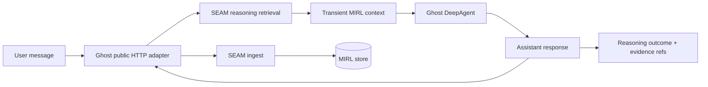

# Ghost

Ghost is a DeepAgent whose durable memory is provided by an authenticated,
opaque SEAM service. Ghost contains no private SEAM/MIRL implementation: it
uses bounded `/v1` HTTP routes to recall evidence, record action checks, accept
completed turns, and reject failed ones.

A knowledge graph is one part of Ghost's intended second brain, not the whole
system. RAW evidence and MIRL remain canonical truth; graph, vector, and context
representations are derived and traceable views.

## License and product boundary

Ghost's software is source-available under the
[PolyForm Shield License 1.0.0](LICENSE). It may be used, modified, and
redistributed for permitted purposes, but the license does not permit using
Ghost to provide a product that competes with Ghost or another product the
licensor provides using it. Read [NOTICE](NOTICE) for the required copyright
notice, line of business, trademark boundary, and excluded brand assets.
See the interim [trademark policy](TRADEMARKS.md) and
[contribution policy](CONTRIBUTING.md) for the pre-company boundary.

PolyForm Shield is not an OSI-approved open-source license. Canticle uses
separate licenses by layer: thin HTTP clients and integration protocols are
Apache-2.0; user-runnable source-available products use PolyForm Shield; and
undistributed SEAM internals, MIRL implementation, planned SEAM-U model assets,
and cloud control planes remain proprietary. The canonical matrix and API
migration boundary are documented in
[Canticle product and licensing structure](docs/product/CANTICLE_PRODUCT_AND_LICENSING_STRUCTURE.md).

## Documentation

Start with the [Ghost engineering wiki](docs/README.md). It is intended to be
sufficient to install, operate, verify, and rebuild Ghost. The exhaustive
[documentation index](docs/INDEX.md) is machine-checked. Primary routes:

- [Installation and first run](docs/operations/INSTALLATION.md)
- [Complete command reference](docs/operations/COMMAND_REFERENCE.md)
- [Operator and developer how-tos](docs/operations/HOW_TO.md)
- [Complete system blueprint](docs/architecture/COMPLETE_SYSTEM_BLUEPRINT.md)
- [Ghost-SEAM HTTP contract](docs/architecture/SEAM_HTTP_CONTRACT.md)
- [Rebuild blueprint](docs/product/REBUILD_BLUEPRINT.md)
- [Current state](docs/status/CURRENT_STATE.md)
- [Second brain and knowledge graph](docs/concepts/SECOND_BRAIN.md)
- [System architecture](docs/architecture/SYSTEM_MAP.md)
- [Memory layers and truth ownership](docs/architecture/MEMORY_LAYERS.md)
- [Memory lifecycle](docs/operations/MEMORY_LIFECYCLE.md)
- [Trust boundaries](docs/security/TRUST_BOUNDARIES.md)
- [Evaluation plan](docs/evaluation/MEMORY_EVALS.md)
- [Stage 1 frozen evaluation suite](docs/evaluation/STAGE1_FROZEN_SUITE.md)
- [Second-brain roadmap](docs/roadmap/SECOND_BRAIN_ROADMAP.md)
- [Canonical build history](HISTORY_INDEX.md)

## Architecture



DeepAgents still owns orchestration, tools, working files, and short-lived
checkpoints. SEAM is the long-term semantic memory layer; it is deliberately not
used as a DeepAgents filesystem backend.

## Requirements

- Python 3.11 or newer
- `uv`
- a reachable SEAM service implementing `/v1/agent/turns/*`
- `OPENAI_API_KEY` in the process environment or an ignored `.env.local`

OpenAI-backed models are sent through the Responses API so reasoning models can
use DeepAgents' function tools.

`pyproject.toml` contains only public package dependencies. `SeamMemory` uses
`httpx` directly so the product lifecycle can use additive agent-turn routes
without importing the private runtime or pretending the legacy `seam-client`
2.x memory-only API provides reasoning parity. The service owns MIRL, storage,
graph, retrieval, correction, and lifecycle policy.

## Setup

```bash
uv sync
export SEAM_BASE_URL="http://127.0.0.1:8765"
export SEAM_API_TOKEN="<set locally when the service requires it>"
uv run ghost "What do you remember about this project?"
```

Ghost never opens a semantic-memory database. The configured SEAM service owns
that state. `GHOST_SEAM_DB` remains only as a legacy path from which the default
checkpoint location is derived; new deployments should set
`GHOST_CHECKPOINT_DB` directly.

Conversation checkpoints are persistent and live in a **separate** database
(`GHOST_CHECKPOINT_DB`, defaulting beside the SEAM store), so `--thread-id`
resumes a conversation after the process exits. The checkpoint holds execution
state — where the conversation got to — and never semantic truth; SEAM remains
the only thing that remembers what was said. Keeping them in different files
makes that boundary physical rather than a convention.

Override configuration through environment variables when needed:

```bash
export GHOST_MODEL="openai:gpt-5.6-terra"
export SEAM_BASE_URL="https://seam.example"
export SEAM_API_TOKEN="<secret>"
export GHOST_CHECKPOINT_DB="$PWD/.state/checkpoints.db"
export GHOST_SEAM_NAMESPACE="ghost.default"
export GHOST_SEAM_SCOPE="thread"
export GHOST_WORKSPACE="default"
export GHOST_PROJECT="default"
export GHOST_MEMORY_ADMISSION="explicit"
```

Run interactively by omitting the prompt:

```bash
uv run ghost --thread-id local-demo
```

Type `/exit` to leave the session.

## Tools

Ghost's tools are read-only, built to the contract in
[`docs/security/TRUST_BOUNDARIES.md`](docs/security/TRUST_BOUNDARIES.md).

| Tool | Does | Available |
|---|---|---|
| `seam_recall` | reads Ghost's durable SEAM memory | always |
| `read_file` | reads one UTF-8 file inside a configured root | when `GHOST_TOOL_ROOTS` is set |
| `search_repo` | searches configured roots for a literal string | when `GHOST_TOOL_ROOTS` is set |
| `run_command` | **runs a shell command — changes the machine** | when `GHOST_ENABLE_SHELL=1` |

`seam_recall` is a deliberate mid-turn lookup, distinct from the automatic
pre-turn recall the middleware performs. It reaches SEAM only through
`SeamMemory.query_knowledge`, so completion, failure, action, deletion, and
administrative routes are unreachable from a model tool — a tool that can
delete memory is a tool a prompt injection can delete memory with.

The filesystem tools are absent unless the operator names readable roots:

```bash
export GHOST_TOOL_ROOTS="/path/to/repo:/path/to/notes"
```

Every path is resolved before the containment check, so a symlink inside a root
that points outside it is refused rather than followed. `search_repo` accepts
only relative, traversal-free globs. It resolves every matched candidate
against the root that produced it before opening or formatting the result.

### Shell access

`run_command` gives Ghost your account's full authority on the machine. It is
off unless you turn it on:

```bash
export GHOST_ENABLE_SHELL=1
export GHOST_SHELL_WORKDIR="/path/to/work"   # defaults to the current directory
```

There is deliberately **no denylist of dangerous commands**. Pattern-matching
shell strings is trivially bypassable and would imply a protection that does
not exist. The real controls are:

- **opt-in** — without `GHOST_ENABLE_SHELL` the tool is not built at all;
- **approval** — `GHOST_SHELL_APPROVAL` defaults on whenever the shell is on,
  and the CLI prompts on the terminal before each command. With no terminal to
  ask, the answer is no. Set it to `0` only for deliberate unattended runs;
- **timeouts** — every command is capped, and the model may narrow that cap but
  never widen it; and
- **verification** — each command becomes a `decision` node with a `tool` check
  carrying its real exit code, and SEAM refuses to accept the turn's outcome
  against a check that failed.

The command's model-facing text is not its verdict. `run_command` carries a
separate versioned result artifact with the real exit code, duration, success
state, and truncation state. Ghost validates that artifact before recording the
attempt; a missing, malformed, or internally inconsistent command artifact is
recorded as failed and cannot supply outcome support.

A refused command is returned to Ghost as a tool result, not an exception, so
declining one command does not end the conversation.

Command output is passed to SEAM as a check result, which SEAM reduces to a
length and a SHA-256. The output itself is never stored, which is what makes
shell output admissible at all — it routinely carries environment and tokens
that [trust boundaries](docs/security/TRUST_BOUNDARIES.md) forbid becoming
durable memory.

## Memory lifecycle

For every root turn, Ghost:

1. asks the SEAM service to open a reasoning-backed turn;
2. receives bounded public memories selected with graph expansion;
3. injects that bounded text transiently into model context;
4. runs the DeepAgent;
5. sends tool attempts for server-side decision/check recording;
6. deterministically classifies a completed turn as admit, reject, or review;
7. completes through the public API, where SEAM records that decision and
   ingests only admitted turns; or
8. sends only the exception class to reject a failed turn without ingest.

Recall happens before the current turn is ingested, so a response cannot cite
its own newly written memory. Retrieved text is labeled as untrusted evidence,
not instructions, and does not accumulate in the LangGraph checkpoint.

The default `explicit` policy stores an explicit remember request, leaves an
unconfirmed durable-looking fact for review, and rejects ordinary conversation.
The model's own output cannot promote itself. Memory mutation remains outside
the model tool surface:

```bash
uv run ghost memory remember "I prefer concise answers." --thread-id default
uv run ghost memory recall "answer style" --thread-id default
uv run ghost memory correct mem_0123456789abcdef01234567 "I prefer concise answers with citations."
uv run ghost memory recall "answer style" --view history
uv run ghost memory forget mem_89abcdef0123456789abcdef --confirm mem_89abcdef0123456789abcdef
```

## Verification

Tests use an opaque in-memory HTTP contract fake and do not contact a SEAM
deployment or make live model calls:

```bash
uv run pytest
uv run ruff check .
```

A skip never silently means "this test never ran": `tests/conftest.py` fails the
session on any unexplained skip. Set `GHOST_STRICT_NO_SKIP=0` for an ad-hoc
local run only; CI must not skip.

### Continuous integration

Ghost separates automatic provider-free validation from explicit paid work:

- `.github/workflows/public-ci.yml` automatically runs history, docs,
  CI-contract, lint, diff, secret, full-test, build, clean-install, and command
  smoke checks on GitHub-hosted infrastructure;
- `.github/workflows/ci.yml` is manual-only and runs only the paid live-provider
  suite against an explicitly configured SEAM service.

The two CI workflows divide automatic and explicitly paid work as follows:

| Job | Automatic? | Covers |
|---|---|---|
| `repo-hygiene` | yes | ruff, docs/history, CI contract, diff and secret scans |
| `brand-assets` | yes | vendored brand toolkit on hosted Chrome/fontconfig |
| `tests (3.11)` | yes | full provider-free suite on Python 3.11 |
| `tests (3.13)` | yes | full provider-free suite on Python 3.13 |
| `package-smoke` | yes | wheel/sdist build, clean install, and `ghost --help` |
| `stage1-evals` | yes | frozen fixture validation, BIL-0 seal/verify, and safety gate |
| `live` | no | paid provider plus configured SEAM service integration |

`tests/test_ci_contract.py` fails if a private source dependency returns, the
full suite leaves hosted automatic CI, the clean wheel is no longer installed,
or paid live tests become automatic. No Ghost workflow targets a self-hosted
runner.

### Public repository boundary

Ghost is public. Automatic workflows run only on GitHub-hosted infrastructure,
external contributors require workflow approval, repository Actions have
read-only defaults, secret scanning and push protection are enabled, and no
self-hosted runner is assigned to Ghost. Protected `main` requires exactly
`repo-hygiene`, `brand-assets`, `tests (3.11)`, `tests (3.13)`,
`package-smoke`, and `stage1-evals`. Private CI cannot start automatically and paid live tests
require an additional explicit input.

The full threat model, exact merge/run evidence, settings boundary, and rules
for any later private-runner assignment are in
[`docs/security/PUBLIC_REPOSITORY_AND_RUNNER.md`](docs/security/PUBLIC_REPOSITORY_AND_RUNNER.md).

## Identity

Ghost has a mark. It lives in [`branding/`](branding/) with full usage notes in
[`branding/README.md`](branding/README.md).

| File | Use |
|---|---|
| `branding/ghost.svg` | above 32px |
| `branding/ghost-mark.svg` | 32px and below |
| `branding/ghost.ico` | favicon, six sizes |
| `branding/ghost-faces.svg` | twelve swappable kaomoji expressions |

He is a being of light with a neural constellation firing at his core, and his
eyes are the SEAM lockup — the `❯` prompt and the `█` block cursor. That is the
architecture drawn: Ghost is a DeepAgent whose durable memory is SEAM, so the
constellation is the memory layer seen through the body, and the face is the
substrate he runs on.

He also has faces. `branding/ghost-faces.svg` carries the body and twelve
expressions as separate symbols — `^ ^`, `> <`, `✧ ✧`, `〉 █` and more — so a
surface can show what he is doing without a word of chrome. Only the default
`❯ █` face belongs in a mark or favicon; the rest are the character acting.

Every part of the mark is RGB, cycling the eight Canticle hues as one on an
8 second loop. Nothing holds a fixed colour. All motion stops under
`prefers-reduced-motion`.
