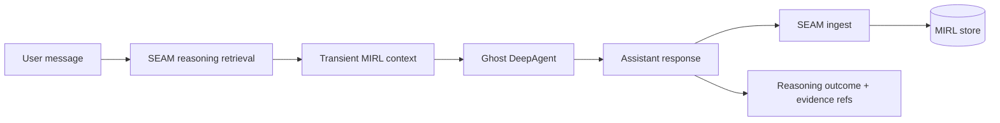

# Ghost

Ghost is a DeepAgent whose durable memory is provided by the private SEAM SDK.
SEAM compiles completed turns into MIRL, retrieves bounded evidence before the
next turn, and records which memories supported each agent run.

## Architecture



DeepAgents still owns orchestration, tools, working files, and short-lived
checkpoints. SEAM is the long-term semantic memory layer; it is deliberately not
used as a DeepAgents filesystem backend.

## Requirements

- Python 3.11 or newer
- `uv`
- A checkout of the private SEAM repository
- `OPENAI_API_KEY` in the process environment or an ignored `.env.local`

The checked-in `uv` source points to this machine's private SEAM checkout:

```text
/home/terrabyte/Documents/Projects/Seam
```

If the checkout moves, update `tool.uv.sources.seam-runtime.path` in
`pyproject.toml`. Do not replace it with the legacy public `seam-runtime`
package; Ghost requires the private `SeamSDK` and MIRL runtime.
The `pgvector` extra is installed because Ghost honors the operator's existing
`SEAM_PGVECTOR_DSN` when one is configured.

## Setup

```bash
uv sync
uv run ghost "What do you remember about this project?"
```

Ghost reuses the unified SEAM database by default:

```text
/home/terrabyte/Documents/Projects/Seam/seam.db
```

Override configuration through environment variables when needed:

```bash
export GHOST_MODEL="openai:gpt-5.6-terra"
export GHOST_SEAM_DB="/path/to/seam.db"
export GHOST_SEAM_NAMESPACE="ghost.default"
export GHOST_SEAM_SCOPE="thread"
```

Run interactively by omitting the prompt:

```bash
uv run ghost --thread-id local-demo
```

Type `/exit` to leave the session.

## Memory lifecycle

For every successful root turn, Ghost:

1. opens a private SEAM reasoning run;
2. retrieves a bounded `mix` result with graph expansion;
3. injects selected MIRL records transiently into model context;
4. runs the DeepAgent;
5. ingests the completed user/assistant turn through `SeamSDK.ingest()`; and
6. finalizes the reasoning run with exact evidence and stored-record refs.

Recall happens before the current turn is ingested, so a response cannot cite
its own newly written memory. Retrieved text is labeled as untrusted evidence,
not instructions, and does not accumulate in the LangGraph checkpoint.

## Verification

Tests use temporary SQLite databases and do not touch the unified SEAM store or
make live model calls:

```bash
uv run pytest
uv run ruff check .
```
