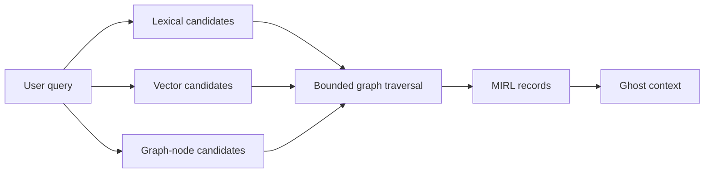

# Knowledge graph in Ghost's second brain

## Its role

SEAM's knowledge graph is a self-building, provenance-aware projection over
canonical MIRL. It helps Ghost traverse relationships that lexical or vector
similarity alone may miss.

Examples include:

- a person connected to a project through ownership;
- a decision connected to the event and source that produced it;
- a current state connected to earlier claims and corrections;
- a failure connected to its cause, attempted repair, and verification;
- an answerable fact connected to the exact source episode that supports it.

The graph is valuable because a second brain needs relationships. It is
insufficient by itself because RAW, canonical meaning, trust, lifecycle,
retrieval policy, and execution live elsewhere.

## Graph retrieval path

Graph traversal does not return free-floating invented facts. Graph hits must
resolve to in-boundary MIRL records and preserve evidence paths. Ghost currently
requests mixed retrieval with `graph_hops` defaulting to two.

## Do not confuse the three graphs

| Graph | Primary question | Contents | Canonical knowledge? | Ghost status |
|---|---|---|---:|---|
| SEAM knowledge graph | What is known and how is it related? | entities, claims, events, states, sources, typed edges, episodes | No; derived from MIRL/RAW | Used by retrieval |
| SEAM reasoning graph | Why was this outcome accepted? | objective, bounded evidence refs, decisions, checks, outcome | No; durable public justification | Reasoning run and outcome used |
| LangGraph execution graph | What should the agent do next? | messages, nodes, tool loops, interrupts, checkpoints | No; operational state | Runs Ghost |

The reasoning graph is not hidden chain-of-thought. It stores bounded,
auditable structure and exact evidence references. LangGraph is not a semantic
knowledge database. The knowledge graph is not a task scheduler.

## Trust and temporal behavior

A graph edge indicates a recorded relationship, not automatic truth or access.
Retrieval still needs:

- namespace and scope agreement;
- current versus historical view selection;
- lifecycle filtering for superseded or deleted records;
- trust-state handling for supported, contested, refuted, or stale knowledge;
- exact provenance routes; and
- bounded traversal depth and candidate limits.

## What Ghost still needs

Current Ghost uses graph-assisted recall but does not yet provide:

- graph inspection tools for the agent;
- user-visible citations and path explanations;
- a policy for when graph evidence materially influenced an answer;
- graph-specific evaluations against lexical/vector-only baselines;
- correction and merge workflows; or
- scoped graph exploration tools for specialist subagents.

These belong after the root memory lifecycle and isolation rules are reliable.

