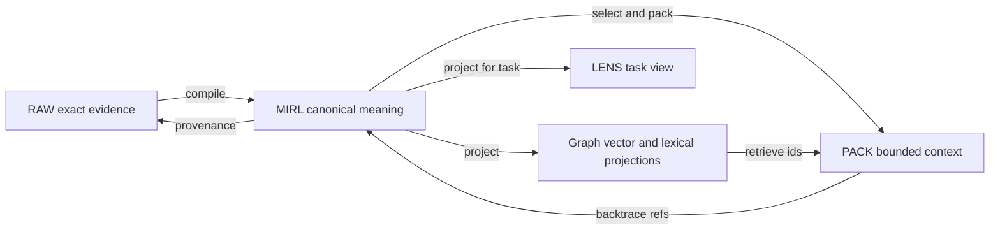

# Memory layers and truth ownership

Ghost follows SEAM's layered memory model. One representation is not expected
to preserve exact wording, canonical meaning, graph topology, and prompt
efficiency simultaneously.

## Layer map

## Durability matrix

| Representation | Preserves | Durable truth? | Rebuildable? | Used directly by Ghost today? |
|---|---|---:|---:|---:|
| RAW | exact source phrasing and evidence | Yes | No | Indirectly through ingest/provenance |
| MIRL | canonical semantic meaning, state, time, confidence, references | Yes | No | Yes |
| Knowledge graph | relationships, episodes, paths, trust projections | No | Yes, from MIRL/RAW | Yes, through mixed retrieval |
| Vector index | semantic search representation | No | Yes | Yes, when configured |
| Lexical index | term-oriented search representation | No | Yes | Yes |
| PACK | bounded task context with canonical refs | No | Yes | Ghost currently renders selected records directly; fuller PACK use is planned |
| LENS | task-specific view | No | Yes | Planned |
| LangGraph checkpoint | execution state and resumability | Operational state only | Replaceable | Persistent SQLite through `GHOST_CHECKPOINT_DB` |
| Reasoning graph | auditable outcome and verification structure | Durable non-canonical artifact | Not canonical truth | Partially, through reasoning runs |

## Canonical write rule

New information enters through an explicit SEAM ingest operation or an admitted
completed turn. The runtime
stores source evidence, compiles semantic records, and updates projections under
the SEAM contract. Ghost must not write graph edges or vector rows directly.

Ghost now classifies every successful root turn through the provider-free policy
in `ghost.memory_policy`. The default `explicit` mode admits only an operator's
explicit remember request, marks unconfirmed durable-looking facts `review`,
and rejects ordinary or transient turns. The model's own output cannot promote
itself. `all` and `off` are deliberate operator overrides.

Admission answers:

- Is this information durable or merely conversational?
- Is it a user preference, project fact, decision, event, task state, or source?
- Does it contain a correction or contradiction?
- Which namespace and scope own it?
- What evidence and confidence support it?
- Is review required before it becomes assertable knowledge?

## Read rule

Derived retrieval legs locate candidate MIRL records. Selection remains bounded
by namespace, scope, budget, lifecycle, and trust. Returned context must retain
record identifiers so the answer can be traced back through MIRL to RAW.

Ghost currently uses a mixed retrieval decision with configurable graph hops,
then renders selected candidates as escaped JSON Lines. This is context, not an
instruction channel and not a new memory copy.

## Correction rule

A second brain must never repair inconsistency by rewriting history invisibly.
Corrections should produce additive evidence, explicit correction or
supersession relationships, and a resolved current state. The earlier claim
remains available in history with its original provenance.

Ghost exposes correction and forgetting as operator-only CLI operations, never
as model-callable tools. Correction writes replacement evidence plus an
explicit `supersedes` relation, then retires the old record through SEAM's
canonical soft-delete lifecycle. Forgetting uses that same lifecycle directly.

## Rebuild rule

If a derived graph, vector index, PACK, or lens is lost or stale, it should be
reconstructable from canonical records through a versioned SEAM operation. If
RAW or MIRL is lost, rebuilding a projection cannot restore the missing truth.
