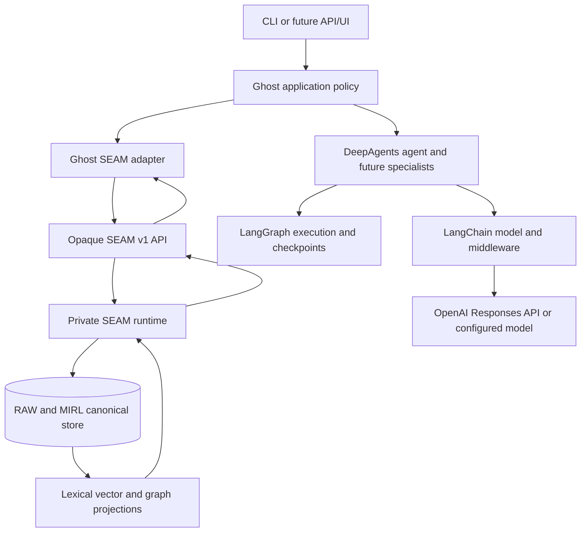
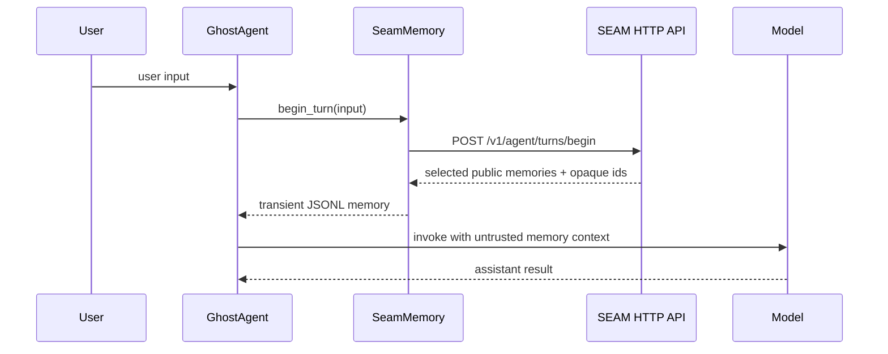
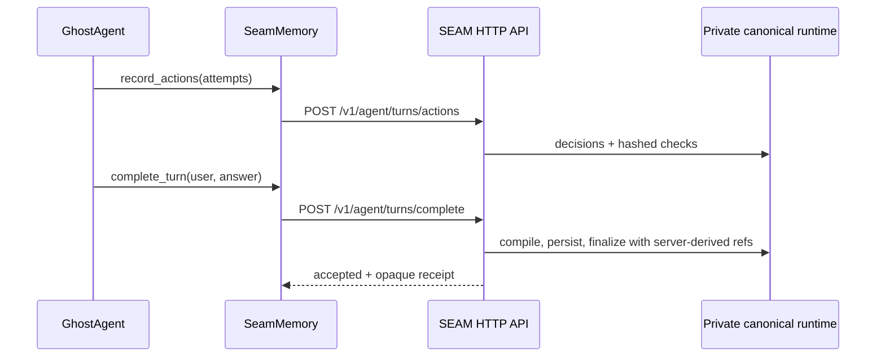

# Ghost system map

## System boundary

Ghost is an agent application built on DeepAgents, LangChain, LangGraph, and
an opaque authenticated SEAM service. Each layer has a separate responsibility.

## Ownership matrix

| Layer | Owns | Must not become |
|---|---|---|
| Ghost | mission, turn policy, tools, memory admission, user experience | a copy of the SEAM runtime |
| DeepAgents | agent loop, planning, working files, delegation | canonical long-term memory |
| LangChain | model adapters and middleware | an authorization or truth layer |
| LangGraph | execution state, checkpoints, interrupts, resumability | the knowledge graph |
| SEAM public API | bounded memory and agent-turn operations | private implementation leakage |
| SEAM runtime | MIRL, storage, retrieval, reasoning, lifecycle | Ghost-specific product policy |
| MIRL/RAW | canonical meaning and source evidence | disposable prompt context |
| Knowledge/vector indexes | retrieval acceleration and topology | a second source of truth |
| Model provider | inference | durable memory or final authority |

## Current pre-turn path

## Current post-turn path

## Current versus planned

| Capability | Status | Evidence or destination |
|---|---|---|
| Synchronous root-agent turn | Current | `src/ghost/application.py` |
| Opaque service recall and accepted-turn ingest | Current | `src/ghost/seam_memory.py` |
| Verified action graph (decision → tool check → verified outcome) | Current | `SeamMemory.record_actions` |
| Injection-resistant transient recall | Current | `src/ghost/middleware.py` |
| Persistent LangGraph checkpoint | Current | `SqliteSaver` in `src/ghost/application.py` |
| Read-first tools | Current | memory recall, bounded file read and literal search |
| Opt-in shell control | Current | unsandboxed, approval/timeout/verification bounded |
| Frozen Stage 1 task qualification | Planned next | roadmap G1 exit gate |
| Selective memory admission | Planned | roadmap stage 2 |
| Correction and forgetting UX | Planned | roadmap stage 2 |
| Custom research/coding/verifier subagents | Planned | roadmap stage 3 |
| Authenticated service and UI | Planned | roadmap stage 4 |

## Dependency boundary

Private SEAM implementation stays in its private repository and deployment.
Ghost contains only an independently authored HTTP adapter that maps agent
turns into additive opaque operations. The package has no private Git source,
does not expose canonical record IDs, and cannot call storage or graph
internals. This keeps MIRL migrations, retrieval, projection, and storage
versioned with SEAM while allowing Ghost to install and evolve independently.

See [ADR-0005](../decisions/0005-opaque-seam-service-boundary.md) for the
current transport decision. ADR-0001 remains the ownership foundation.
