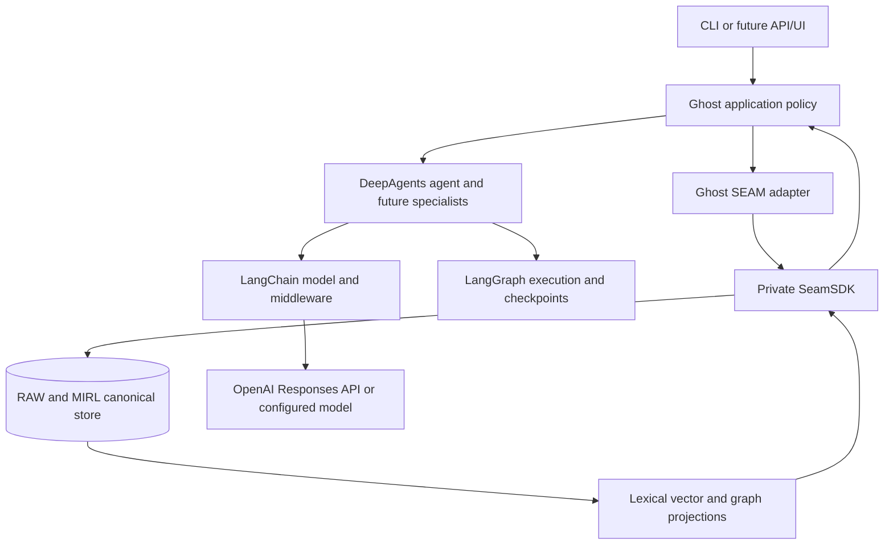
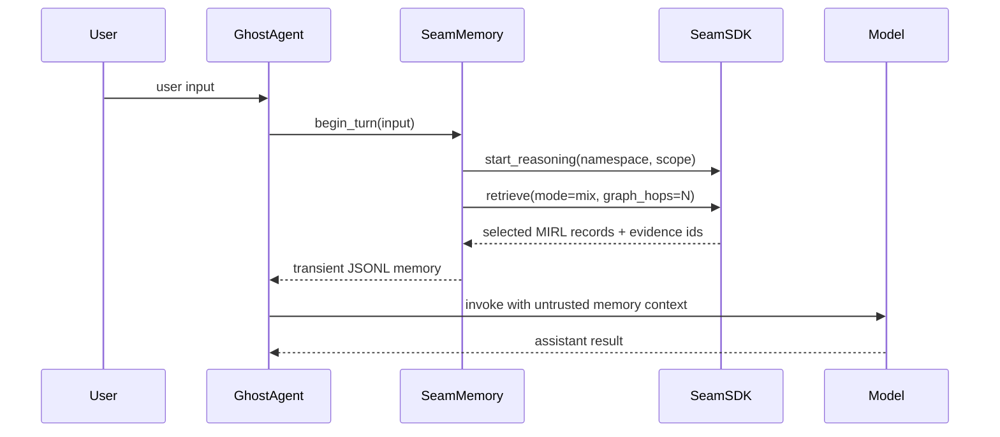
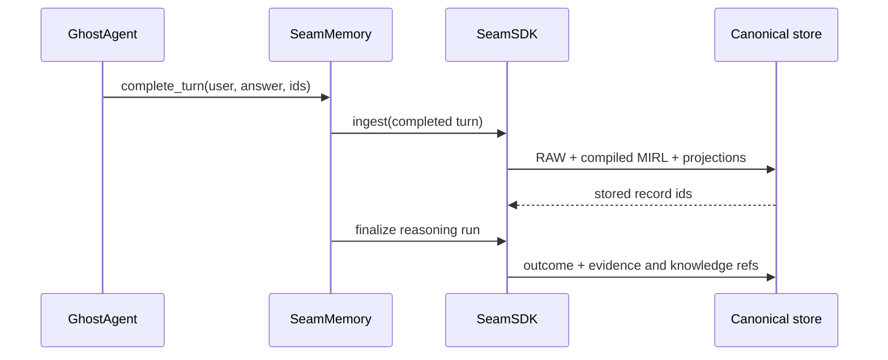

# Ghost system map

## System boundary

Ghost is an agent application built on DeepAgents, LangChain, LangGraph, and
the private SEAM runtime. Each layer has a separate responsibility.

## Ownership matrix

| Layer | Owns | Must not become |
|---|---|---|
| Ghost | mission, turn policy, tools, memory admission, user experience | a copy of the SEAM runtime |
| DeepAgents | agent loop, planning, working files, delegation | canonical long-term memory |
| LangChain | model adapters and middleware | an authorization or truth layer |
| LangGraph | execution state, checkpoints, interrupts, resumability | the knowledge graph |
| SEAM SDK | memory operations and typed reasoning sessions | Ghost-specific product policy |
| MIRL/RAW | canonical meaning and source evidence | disposable prompt context |
| Knowledge/vector indexes | retrieval acceleration and topology | a second source of truth |
| Model provider | inference | durable memory or final authority |

## Current pre-turn path

## Current post-turn path

## Current versus planned

| Capability | Status | Evidence or destination |
|---|---|---|
| Synchronous root-agent turn | Current | `src/ghost/application.py` |
| Private SDK recall and MIRL ingest | Current | `src/ghost/seam_memory.py` |
| Verified action graph (decision → tool check → verified outcome) | Current | `SeamMemory.record_actions` |
| Injection-resistant transient recall | Current | `src/ghost/middleware.py` |
| Persistent LangGraph checkpoint | Current | `SqliteSaver` in `src/ghost/application.py` |
| Persistent checkpoint | Current | SQLite LangGraph checkpoint in `application.py` |
| Read-first tools | Current | memory recall, bounded file read and literal search |
| Opt-in shell control | Current | unsandboxed, approval/timeout/verification bounded |
| Frozen Stage 1 task qualification | Planned next | roadmap G1 exit gate |
| Selective memory admission | Planned | roadmap stage 2 |
| Correction and forgetting UX | Planned | roadmap stage 2 |
| Custom research/coding/verifier subagents | Planned | roadmap stage 3 |
| Authenticated service and UI | Planned | roadmap stage 4 |

## Dependency boundary

The private SEAM SDK stays in the SEAM repository. Ghost pins an exact private
SEAM revision and imports `SeamSDK`; Ghost contains only the adapter that maps
agent turns into SDK operations. This keeps MIRL migrations, retrieval, graph
projection, and storage contracts versioned with SEAM while allowing Ghost's
agent policy to evolve independently.

See [ADR-0001](../decisions/0001-seam-memory-boundary.md) for the durable
decision.
