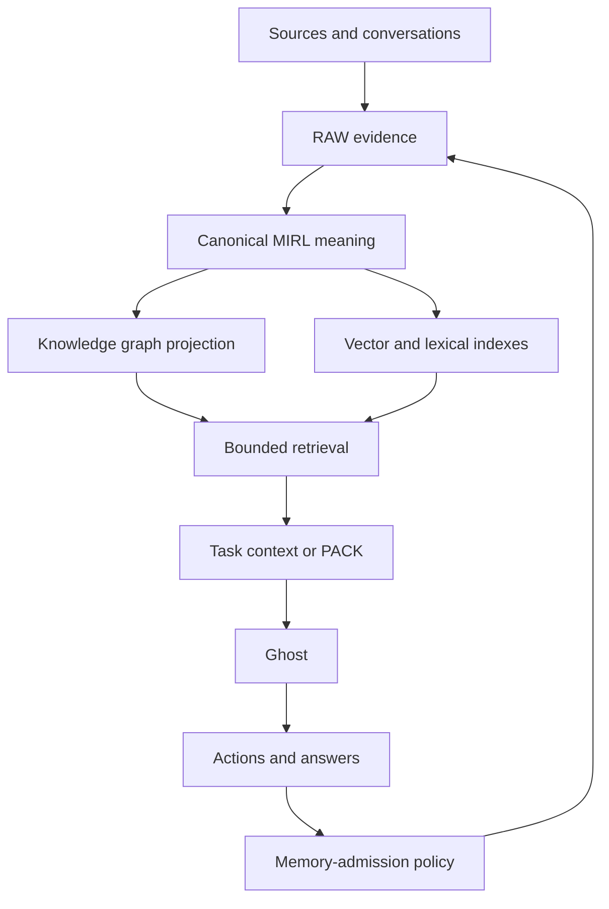

# Second brain and knowledge graph

## Short answer

A knowledge graph can be an important organ of a second brain, but the two are
not equivalent.

```text
knowledge graph = connected representation of entities and relationships

second brain = capture + evidence + canonical memory + retrieval + graph +
               current state + correction + context + tools + interfaces
```

A graph helps the system answer questions such as:

- What depends on this project?
- Which person made this decision?
- What evidence supports this claim?
- What changed after this event?

A second brain must additionally answer:

- What exact source did this come from?
- Is it current, contradicted, uncertain, or superseded?
- Should this observation be remembered at all?
- Which memories are relevant to the task now?
- How much context can safely fit in the model prompt?
- How can the user correct or forget something?
- Which user or workspace is allowed to retrieve it?

## The Ghost model



In this model:

- RAW preserves exact source evidence.
- MIRL preserves canonical meaning and provenance.
- The knowledge graph exposes useful relationships and paths.
- Vector and lexical indexes locate semantically relevant records.
- Retrieval selects a bounded evidence set.
- PACK or transient context prepares memory for the model.
- Ghost acts through tools and produces new observations.
- Memory admission decides what re-enters durable memory.

The current Ghost implementation has RAW/MIRL ingest, mixed retrieval, graph
expansion, transient context injection, and reasoning provenance. Selective
memory admission, corrections, deletion UX, durable checkpoints, domain tools,
and specialist subagents remain planned.

## Why a graph alone is insufficient

### It may discard source phrasing

A graph often normalizes a sentence into nodes and edges. That is useful for
navigation, but quotations, tables, code, and exact wording still need RAW
evidence.

### It can blur claims and resolved state

Two conflicting claims may both exist. A second brain must preserve both,
their evidence, their temporal validity, and the resolved current state.

### It does not define retrieval policy

Having a connected graph does not decide which paths matter for the current
question, how far traversal may expand, or how much context should be emitted.

### It does not define trust or access

An edge can exist without being verified or authorized for a caller. Trust,
namespace, scope, and lifecycle controls remain separate contracts.

### It does not run the agent

The knowledge graph describes memory. LangGraph controls Ghost's execution.
Conflating them makes operational state look like knowledge and makes knowledge
look like a sequence of control-flow steps.

## Three useful analogies

| Human analogy | Ghost/SEAM component |
|---|---|
| Notes, recordings, and receipts | RAW evidence |
| Stable concepts and remembered meaning | MIRL |
| Mental association network | Knowledge graph |
| Attention and recall | Retrieval and PACK |
| Train of work | LangGraph execution |
| Explanation of why a conclusion was accepted | Reasoning graph |

The analogy is intentionally limited: Ghost's memory must be explicit,
auditable, scoped, and testable rather than pretending to reproduce a human
mind.

## Success criteria for a real second brain

Ghost becomes a dependable second brain only when it can demonstrate:

1. durable capture with exact provenance;
2. relevant recall without indiscriminate transcript loading;
3. correction and supersession without silent history loss;
4. isolation across users and workspaces;
5. bounded, injection-resistant context;
6. useful graph relationships that resolve back to MIRL and RAW;
7. explicit forgetting and lifecycle behavior;
8. measurable task improvement over a no-memory baseline; and
9. safe action through permissioned tools.

See [Memory layers](../architecture/MEMORY_LAYERS.md) for truth ownership and
[Second-brain roadmap](../roadmap/SECOND_BRAIN_ROADMAP.md) for the build order.

