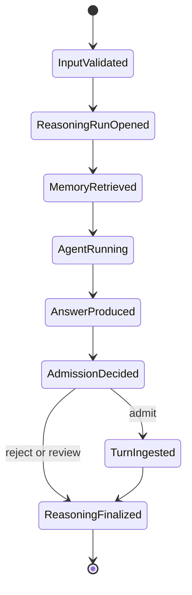
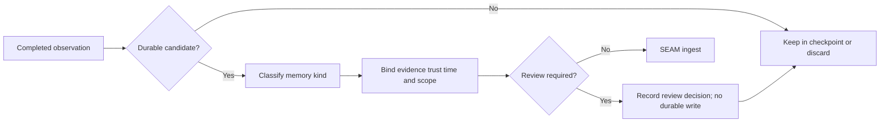

# Ghost memory lifecycle

## Current lifecycle

Ghost uses one explicit pre-turn recall boundary and one successful post-turn
admission boundary.

### 1. Validate input

Blank input fails before recall. A turn receives a caller-supplied or generated
turn ID, while LangGraph receives a thread ID.

### 2. Open a reasoning run

`POST /v1/agent/turns/begin` binds the objective to Ghost's public namespace,
scope, agent ID, model, and provider. The service derives any principal/tenant
boundary and returns an opaque turn handle.

### 3. Recall

The service performs bounded mixed retrieval with the configured record budget
and graph-hop limit. Ghost receives public text and opaque `mem_...` evidence
handles, never canonical record IDs or ranking internals.

### 4. Inject context

Selected public memories are rendered as bounded JSON Lines. Angle brackets are
escaped, and middleware labels the payload as untrusted evidence rather than
instructions. The payload is added transiently to the model request and does
not become checkpoint history.

### 5. Run Ghost

DeepAgents and LangGraph execute the model and any framework tools. Current
execution is synchronous and uses a persistent SQLite checkpoint saver.

### 6. Classify only a completed turn

After Ghost produces a result, tool attempts go to
`POST /v1/agent/turns/actions`. The completed user input and assistant output
then go to `POST /v1/agent/turns/complete` with an admit/reject/review decision.
SEAM derives selected evidence and passed checks from server state. It compiles
MIRL and updates derived indexes only for `admit`; reject/review still finalize
the reasoning outcome with zero memory writes. Recall precedes any write,
preventing self-citation.

### 7. Finalize provenance

SEAM accepts the outcome against server-derived evidence and checks, then
returns only an opaque receipt. Ghost cannot forge evidence or verification
support by sending client-selected IDs.

## Idempotency

The service owns the authoritative turn identity and deterministic receipt.
Repeating an accepted completion returns the same receipt with `replayed=true`;
actions after a terminal outcome conflict. A failed terminal replay remains
rejected and does not ingest.

## Admission lifecycle

Ghost no longer persists every successful turn. The current deliberate policy
is:

The current `review` result is an auditable non-admission decision. Ghost does
not yet provide a pending-proposal queue or later approve/reject command; those
belong to the future operator surface and must not be implied by this policy.

The default classifier distinguishes preferences, stable project facts,
decisions, events, procedures, task state, unconfirmed durable candidates, and
transient conversation. It is deterministic and never calls a provider.

Configuration:

| `GHOST_MEMORY_ADMISSION` | Behavior |
|---|---|
| `explicit` | default; admit explicit remember, review unconfirmed durable candidates, reject the rest |
| `all` | compatibility/operator override; admit every completed turn |
| `off` | reject every automatic candidate; explicit CLI remember still works |

## Correction lifecycle

1. Recall the current memory and copy its opaque `mem_` reference.
2. Run `ghost memory correct MEM_ID TEXT` in the same boundary.
3. SEAM compiles the replacement and persists an explicit `supersedes` relation.
4. SEAM soft-deletes the old canonical record and repairs derived projections.
5. Current recall returns the replacement; history recall retains the old
   record with `status: deleted_soft`.

## Forgetting lifecycle

Forgetting must be a scoped lifecycle operation, not a direct file or graph-row
deletion. It should:

1. identify the exact opaque `mem_` reference through current recall;
2. require the operator to repeat that reference with `--confirm`;
3. bind the request to the same principal/workspace/project/thread boundary;
4. apply canonical soft deletion and recoverable derived cleanup; and
5. return an opaque deletion receipt/status while current recall excludes it.

## Failure lifecycle

If model, tool, or checkpoint execution raises, Ghost calls
`POST /v1/agent/turns/fail` with only the exception class. Exception text,
traceback, provider payload, partial assistant output, and hidden reasoning do
not cross the boundary. SEAM records a rejected outcome and does not compile or
ingest the failed exchange; Ghost then re-raises the original failure to its
operator or supervisor.
