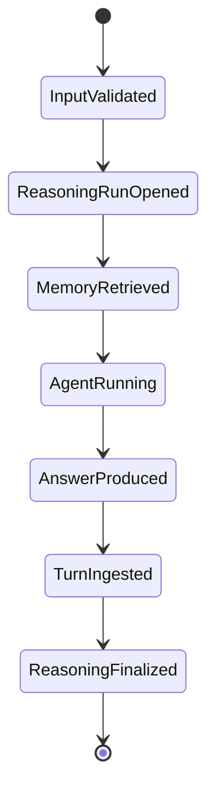
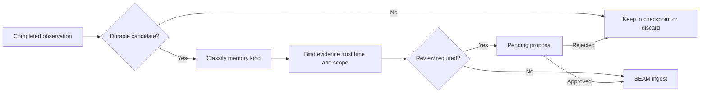

# Ghost memory lifecycle

## Current lifecycle

Ghost uses one explicit pre-turn recall boundary and one successful post-turn
write boundary.

### 1. Validate input

Blank input fails before recall. A turn receives a caller-supplied or generated
turn ID, while LangGraph receives a thread ID.

### 2. Open a reasoning run

`SeamSDK.start_reasoning()` binds the objective to Ghost's namespace, scope,
agent ID, model, and provider.

### 3. Recall

`ReasoningSession.retrieve()` performs bounded mixed retrieval with a configured
record budget and graph-hop limit. The selected record IDs become the turn's
evidence references.

### 4. Inject context

Selected MIRL records are rendered as bounded JSON Lines. Angle brackets are
escaped, and middleware labels the payload as untrusted evidence rather than
instructions. The payload is added transiently to the model request and does
not become checkpoint history.

### 5. Run Ghost

DeepAgents and LangGraph execute the model and any framework tools. Current
execution is synchronous and uses an in-memory checkpoint saver.

### 6. Ingest only a completed turn

After Ghost produces a result, the user input and assistant output are passed
to `SeamSDK.ingest()`. SEAM stores source evidence, compiles MIRL, and updates
derived indexes. Recall happens before this write, preventing the current answer
from retrieving itself.

### 7. Finalize provenance

Ghost reopens the reasoning run and records a bounded completion outcome linked
to retrieved evidence and newly stored knowledge record IDs.

## Idempotency

The source reference is derived from namespace, scope, thread ID, and turn ID.
Retrying the same completed turn identity and content yields stable stored record
IDs. A caller that wants retry safety should preserve the original turn ID.

## Planned admission lifecycle

Automatic persistence of every successful turn is intentionally an early-stage
policy. The mature path should be:

Admission should distinguish preferences, stable project facts, decisions,
events, corrections, procedures, and transient task state.

## Planned correction lifecycle

1. Retrieve the existing memory and exact evidence.
2. Capture the new correction as a new source observation.
3. Persist an explicit corrects, contradicts, or supersedes relationship.
4. Resolve the current state without deleting the historical claim.
5. Verify current and historical retrieval views.

## Planned forgetting lifecycle

Forgetting must be a scoped lifecycle operation, not a direct file or graph-row
deletion. It should:

1. identify exact canonical record IDs;
2. show the planned impact and dependent references;
3. require authorization appropriate to the caller and scope;
4. apply canonical soft deletion or the governing SEAM lifecycle operation;
5. remove or repair derived graph/vector state; and
6. retain an auditable receipt without retaining deleted content improperly.

## Failure lifecycle gap

If model or tool execution fails today, the turn is not ingested, which is
correct, but the opened reasoning run is not explicitly finalized as failed.
Ghost needs a bounded failure outcome carrying error class, stage, and retry
relationship without raw provider payloads, secrets, or hidden reasoning.

