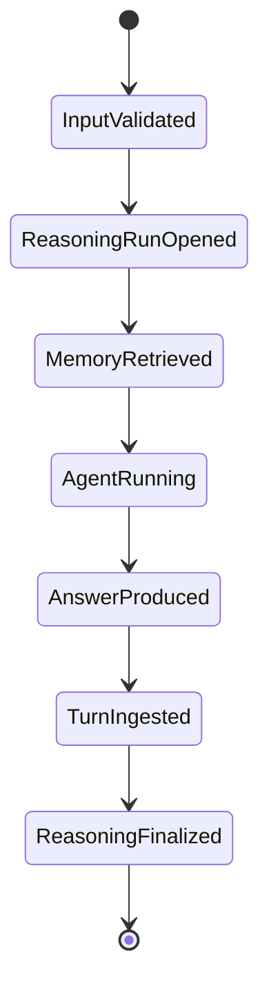
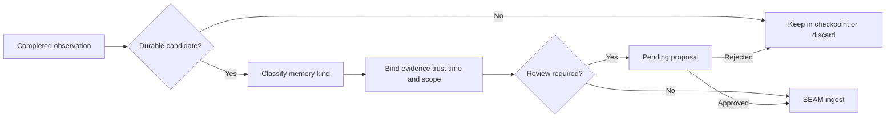

# Ghost memory lifecycle

## Current lifecycle

Ghost uses one explicit pre-turn recall boundary and one successful post-turn
write boundary.

### 1. Validate input

Blank input fails before recall. A turn receives a caller-supplied or generated
turn ID, while LangGraph receives a thread ID.

### 2. Open a reasoning run

`POST /v1/agent/turns/begin` binds the objective to Ghost's public namespace,
scope, agent ID, model, and provider. The service derives any principal/tenant
boundary and returns an opaque turn handle.

### 3. Recall

The service performs bounded mixed retrieval with the configured record budget
and graph-hop limit. Ghost receives public text and opaque `mem_...` evidence
handles, never canonical record IDs or ranking internals.

### 4. Inject context

Selected public memories are rendered as bounded JSON Lines. Angle brackets are
escaped, and middleware labels the payload as untrusted evidence rather than
instructions. The payload is added transiently to the model request and does
not become checkpoint history.

### 5. Run Ghost

DeepAgents and LangGraph execute the model and any framework tools. Current
execution is synchronous and uses a persistent SQLite checkpoint saver.

### 6. Ingest only a completed turn

After Ghost produces a result, tool attempts go to
`POST /v1/agent/turns/actions`. The completed user input and assistant output
then go to `POST /v1/agent/turns/complete`. SEAM derives selected evidence and
passed checks from server state, stores source evidence, compiles MIRL, and
updates derived indexes. Recall precedes this write, preventing self-citation.

### 7. Finalize provenance

SEAM accepts the outcome against server-derived evidence and checks, then
returns only an opaque receipt. Ghost cannot forge evidence or verification
support by sending client-selected IDs.

## Idempotency

The service owns the authoritative turn identity and deterministic receipt.
Repeating an accepted completion returns the same receipt with `replayed=true`;
actions after a terminal outcome conflict. A failed terminal replay remains
rejected and does not ingest.

## Planned admission lifecycle

Automatic persistence of every successful turn is intentionally an early-stage
policy. The mature path should be:

Admission should distinguish preferences, stable project facts, decisions,
events, corrections, procedures, and transient task state.

## Planned correction lifecycle

1. Retrieve the existing memory and exact evidence.
2. Capture the new correction as a new source observation.
3. Persist an explicit corrects, contradicts, or supersedes relationship.
4. Resolve the current state without deleting the historical claim.
5. Verify current and historical retrieval views.

## Planned forgetting lifecycle

Forgetting must be a scoped lifecycle operation, not a direct file or graph-row
deletion. It should:

1. identify exact canonical record IDs;
2. show the planned impact and dependent references;
3. require authorization appropriate to the caller and scope;
4. apply canonical soft deletion or the governing SEAM lifecycle operation;
5. remove or repair derived graph/vector state; and
6. retain an auditable receipt without retaining deleted content improperly.

## Failure lifecycle

If model, tool, or checkpoint execution raises, Ghost calls
`POST /v1/agent/turns/fail` with only the exception class. Exception text,
traceback, provider payload, partial assistant output, and hidden reasoning do
not cross the boundary. SEAM records a rejected outcome and does not compile or
ingest the failed exchange; Ghost then re-raises the original failure to its
operator or supervisor.
